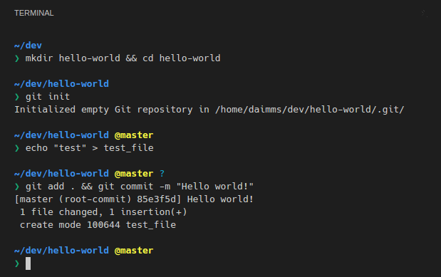
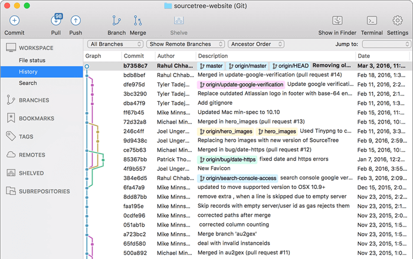

## CLI & GUI

Git을 사용하는 방법으로는 크게 2가지가 있습니다.  

### CLI(Command Line Interface)

CLI는 텍스트 터미널을 통해 사용자와 컴퓨터가 상호작용하는 방식을 말합니다.

### GUI(Graphic User Insterface)

Sourcetree는 GUI의 대표적인 프로그램입니다.  
GUI 프로그램의 대부분은 Git 기능 중 일부만 구현하기 때문에 비교적 단순합니다.  
GUI를 사용하고 싶더라도 CLI가 기본으로 설치되는 도구이기 때문에 CLI기준으로 설명하겠습니다.  

