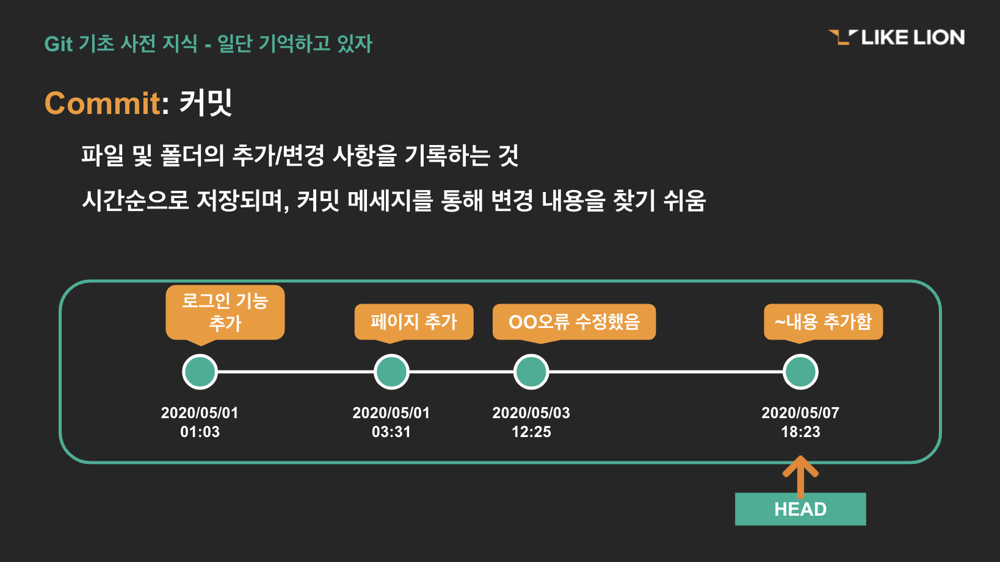

## Commit(커밋)

파일 및 폴더의 추가/변경 사항을 저장소에 기록하려면 커밋을 해주어야 합니다.  
커밋을 하면 이전 커밋 상태부터 현재 상태까지의 변경 이력이 기록된 커밋(혹은 리비전)이 만들어집니다. 
커밋은 위의 그림처럼 시간순으로 저장됩니다. 최근 커밋부터 거슬러 올라가면 과거 변경 이력과 내용을 알 수 있습니다.  
커밋은 변경이력을 남기는 중요한 작업이기 때문에 커밋 메시지를 필수로 입력해야 합니다. 메시지가 없으면 커밋이 실행되지 않습니다.  